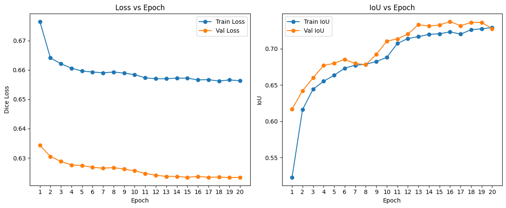
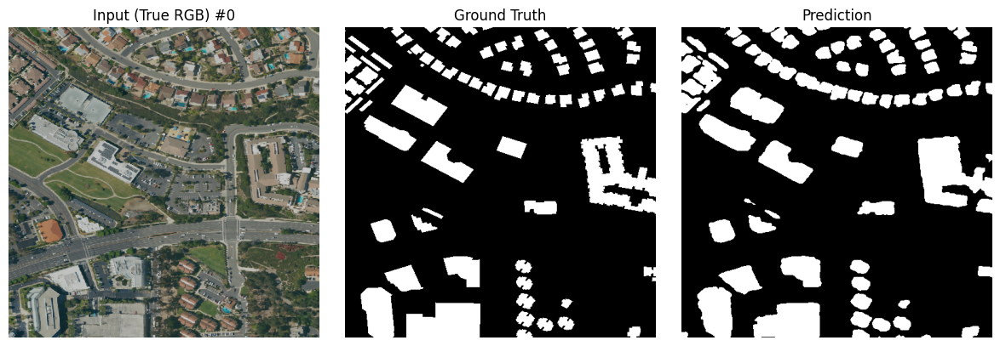
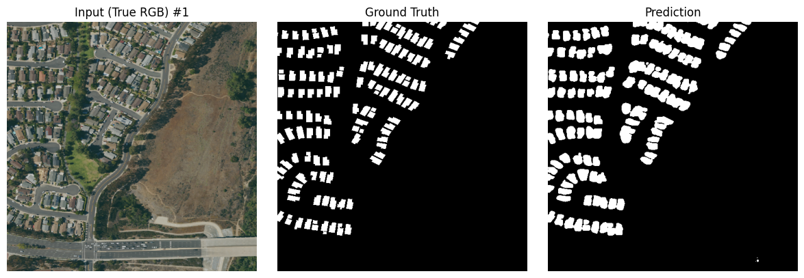
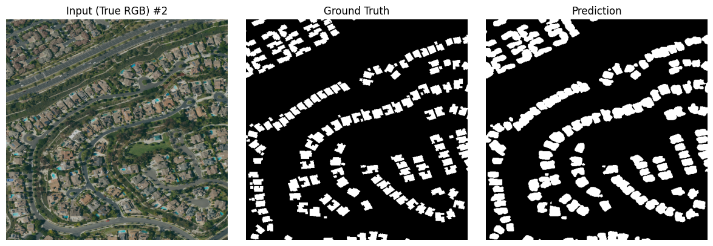
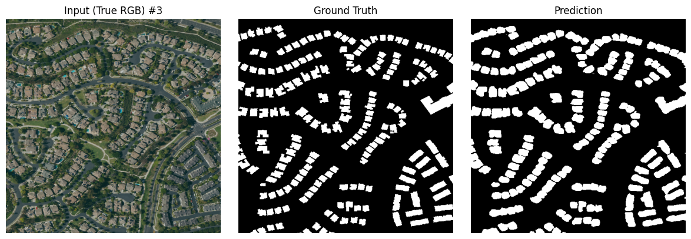

This post demonstrates how we trained a U-Net (with a ResNet-50 encoder pretrained on ImageNet) to extract building footprints from high-resolution NAIP imagery using OpenStreetMap polygons as labels.

## Data

- **Input imagery**: NAIP 1 m RGB tiles over Orange County, CA  
- **Labels**: Rasterized building footprints from OpenStreetMap  

## Model & Training

- **Architecture**: U-Net with a ResNet-50 encoder, skip-connections, and sigmoid output for binary masks  
- **Loss**: Dice loss to handle class imbalance  
- **Optimizer**: Adam (lr = 1e-4) with CosineAnnealingWarmRestarts  
- **Augmentations**: Random flips, 90° rotations, affine jitter  
- **Training**: 20 epochs on 512×512 patches (10 initial + 10 resumed)  

## Convergence Curves

- **Left**: Dice loss decreases on both training (blue) and validation (orange).  
- **Right**: Intersection-over-Union rises from ~0.52 up to ~0.74 over 20 epochs.

## Sample Predictions

### Sample 1

### Sample 2

### Sample 3

### Sample 4

## Vectorized Footprints

After cleaning and simplifying the predicted masks, we convert them to vector polygons and overlay on the original imagery:

## References

- NAIP imagery: https://www.fsa.usda.gov/programs-and-services/aerial-photography/imagery-programs/naip-imagery  
- OpenStreetMap building footprints: https://download.geofabrik.de/  
- Segmentation Models PyTorch: https://github.com/qubvel/segmentation_models.pytorch  