*Updated September 24, 2026. This article expands the original “Building Footprint Extraction with U-Net” post. The initial experiment and its figures are preserved below; the subsequent sections describe the project's development into the US Building Footprint (USBF) workflow.*

This project began with a straightforward question: can a U-Net learn building footprints from aerial imagery? It has since grown into a broader investigation of how to combine imagery, elevation, and existing building inventories while preserving useful geometric detail.

The current workflow uses RGB–height segmentation models to propose selective changes to GlobalBuildingAtlas (GBA) polygons. It keeps the original geometry, building identity, and processing history alongside each result. The work now includes multi-region evaluation, 50,000 training patches, experiments on shape and missing elevation, and a production pipeline processing millions of buildings.

The results also changed the research direction. Visually plausible modifications do not consistently improve agreement with reference footprints. Preserving a strong baseline, measuring failures, and making every accepted change reversible have become central parts of the project.

## Where the project stands

| Component | Verified progress as of September 24, 2026 |
| --- | --- |
| Model development | RGB–height B0 and shape-aware B1; subsequent learning-rate, elevation, architecture, and sampling comparisons |
| Latest experimental data | 50,000 training patches and 818 fixed development-validation patches |
| Frozen scientific evaluation | Four regions, 389 evaluation windows, and 48,772 processed GBA objects |
| Six-state input preparation | 997,522 ready windows across Alabama, Arizona, Arkansas, California, Colorado, and Connecticut |
| Frozen B0/B1 probability generation | Completed for those 997,522 ready windows |
| Production vector output | 7,462,544 buildings recorded as committed; 176,795 modified, at the September 24, 16:19 EDT status snapshot |
| Public dataset release | Pending; the national product is not complete |

These counts describe different stages. An input window is not a training example by default, a probability raster is not a final vector product, and a modified building is not automatically an improved building. Production counts describe internal committed outputs, not a publicly deposited dataset.

## 1. The original U-Net experiment

The May 2025 prototype used 1 m NAIP RGB imagery over Orange County, California, with rasterized OpenStreetMap building polygons as labels. A U-Net with an ImageNet-pretrained ResNet-50 encoder produced binary building masks.

The original setup used Dice loss, Adam with a learning rate of `1e-4`, cosine annealing with warm restarts, and random flips, 90° rotations, and affine jitter. Training ran for 20 epochs on 512 × 512 patches, including a resumed second stage.

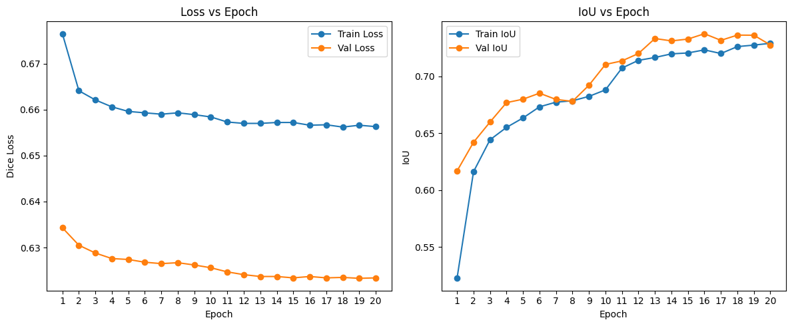

*Historical prototype: validation IoU rose from approximately 0.52 to 0.74. These curves belong to the original experiment and are not the learning curves of the later B0/B1 models.*

The following predictions show the original model's output:

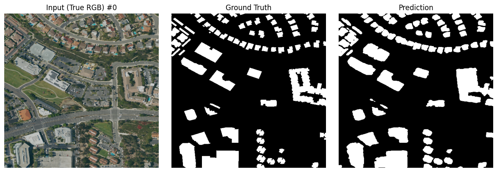
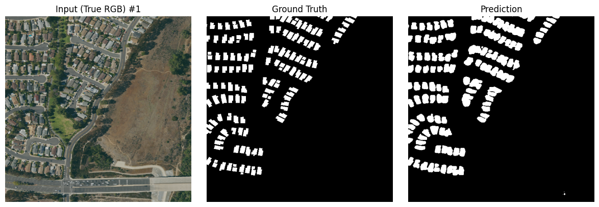
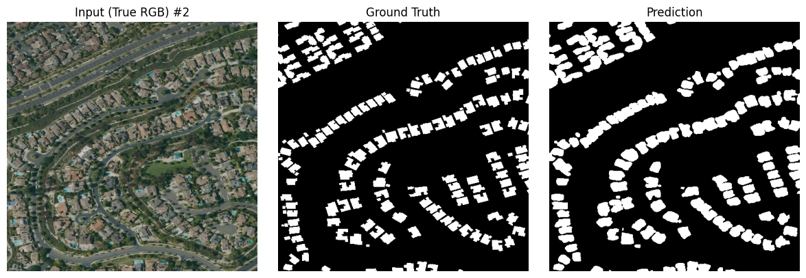
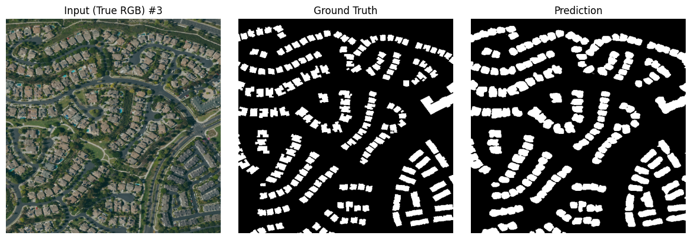

After mask cleaning and simplification, the predictions were converted to vector polygons:

This established an end-to-end imagery-to-polygon baseline. Later work focused on the harder problems behind a useful inventory: separating neighboring buildings, retaining narrow recesses, handling courtyards and curved structures, and recognizing when the available evidence is insufficient to justify an edit.

## 2. Adding elevation and auditing the inputs

RGB imagery provides texture and roof edges, while a normalized digital surface model (nDSM) supplies height above terrain. The current sensor workflow aligns RGB and elevation on a common local UTM grid at 1 m resolution, usually in 512 × 512 windows.

NAIP imagery is selected from available acquisitions through 2025. The workflow tries newer years first and uses a same-year mosaic where possible; source imagery is not uniformly native 1 m or from the same year. The production preparation accepts windows with at least 98% valid RGB coverage.

Elevation comes from available USGS 3DEP DSM/DTM raster pairs. Pairing checks project identity, coordinate reference system, units, and spatial overlap. The physical nDSM retains the signed difference `DSM − DTM`. Only the model input is clipped to 0–30 m and scaled; the original signed heights remain available for geometric decisions.

Missing elevation is explicit. RGB validity, height validity, and label-supervision validity have separate roles. An unavailable height pixel is not interpreted as ground, and the absence of a discovered DSM/DTM pair does not establish that a region has no LiDAR.

| Six-state input status | Windows |
| --- | ---: |
| Ready with complete height coverage | 417,927 |
| Ready with partial height coverage | 257,999 |
| Ready with RGB-only fallback | 321,596 |
| Held for insufficient RGB coverage | 2 |
| Total registered | 997,524 |

Data auditing became a substantial part of the research. It included checking original Massachusetts 15 cm imagery against cached crops, repairing preprocessing inconsistencies, and excluding earlier evaluations in which official reference geometry had influenced elevation preparation. Those invalid evaluations are not used as evidence here.

## 3. From U-Net to RGB–height and shape-aware models

### B0: RGB-led height fusion

The current B0 model is a custom ResNet-50 RGB encoder with a feature-pyramid decoder and a separate height branch. At multiple feature scales, a learned gate combines RGB and height features while accounting for valid elevation coverage. A separate RGB pathway remains available, and a completely missing height input returns the RGB-only result.

This is more than concatenating a fourth channel onto the original U-Net. Height-validity masks are auxiliary metadata, and the learned gates are not calibrated confidence probabilities. Earlier bottleneck and multiscale fusion experiments helped motivate this design, but they are distinct model versions.

### B1: learning boundary and orientation detail

B1 extends B0 with native-resolution RGB features, a boundary head, and a fourfold orientation representation, `(cos(4θ), sin(4θ))`. A residual mask head starts at zero so that initialization preserves the inherited B0 prediction.

Training combines masked mask losses with RGB auxiliary, boundary, and orientation objectives. The orientation targets come from training-label boundaries; they are not independent geometric ground truth. The model provides evidence for shape refinement without forcing every roof to be rectangular or directly decoding finished vector polygons.

The frozen production checkpoints reached the following Orange County development scores:

| Frozen checkpoint | IoU (%) | Boundary F1 at 1 m (%) |
| --- | ---: | ---: |
| B0 control | 84.89 | 86.76 |
| B1 shape-aware | 84.97 | 87.03 |

The selected B0 and B1 checkpoints had different training-update budgets, so these numbers are a checkpoint comparison, not an equal-budget ablation of the shape heads. Production continues to use these frozen September 9 checkpoints; subsequent training results have not automatically replaced them.

### Resolution and geographic transfer

We also compared native 15 cm Massachusetts pretraining with a synthetic 1 m counterpart before transfer to real NAIP imagery. With the same downstream training budget, the best NAIP IoUs were 85.0093% without extra pretraining, 85.0189% with 15 cm pretraining, and 85.0337% with 1 m pretraining. The pretrained arms had additional upstream training, and the small differences do not establish a meaningful nationwide advantage for higher-resolution pretraining.

A September 17 continuation expanded training to 18,921 patches. Relative to the frozen production B1, the selected model's Massachusetts development IoU increased from 76.14% to 77.01%, and the Colorado/Connecticut development IoU increased from 61.93% to 68.89%. Orange County remained approximately 84.95%. These are development-set results against inherited labels, not proof that the model corrects errors in GBA.

## 4. Expanding training and testing what actually helps

Training subsequently grew to 29,525 and then **50,000 distinct patches**, with **818 fixed development-validation patches**. The validation set contains 231 Orange County, 75 Massachusetts, and 512 Colorado/Connecticut patches. The historical 447-patch Orange County test set was not added to these continuation runs.

The expansion uses original GBA labels and existing prepared inputs. Additional Alabama, Arkansas, and Arizona locations increase scene diversity, including denser and larger-building settings. Sampling balances state, building-label density, and elevation availability; Massachusetts patches are sampled separately because of their different dimensions. Colorado and Connecticut remain outside training. This improves the experimental design without making the dataset nationally representative.

### Longer training and elevation robustness

The September 18 ten-hour continuation did not produce a new best checkpoint. The later 50,000-patch balanced continuation reached 48 cumulative training-budget hours and 1,404,698 updates in its completed September 20 run, again retaining the inherited best. A further continuation was initiated, but a planned duration is not reported here as a completed experiment.

A September 21 factorial experiment compared four 30,000-update B1 arms: low learning rate, a warmup/cosine alternative, and each schedule with conservative height augmentation. Height augmentation included missing blocks, fully missing elevation, mild blur, and small shifts. None met the predefined improvement criterion. A follow-on queue completed six replication arms before being checkpointed during another arm; the planned long-budget queue was not completed.

### B0, local R0, and a context-augmented B0

The September 22 comparison trained three routes for 30,000 updates each on the same sample sequence. Here are the final endpoint IoUs, rather than the best intermediate scores:

| Route | Orange County IoU (%) | Massachusetts IoU (%) | CO/CT IoU (%) |
| --- | ---: | ---: | ---: |
| B0 | 84.64 | 77.69 | 67.69 |
| Local R0 reconstruction | 78.64 | 72.25 | 66.61 |
| B0 + GSTDM context module | 84.60 | 77.27 | 67.29 |

The added context module did not outperform B0 on these endpoint IoUs. R0 is a local reconstruction, not the original MMRAD authors' implementation. Initialization, normalization, and architecture-specific learning rates differ, so this practical comparison does not isolate architecture alone or rule out a better-tuned R0.

### September 24: targeted sampling

The latest completed experiment held the B1 architecture, parent checkpoint, loss, labels, and split fixed. Arm A used the existing balanced sampler. Arm B increased sampling of supported small components, partly missed large components, complex boundaries, and selected missing-height patches within the same strata. Candidates came only from training data; labels were not changed.

Both arms completed 30,000 updates and 239,947 sample exposures. Their sample identities intentionally differed.

| Final endpoint | Balanced A | Targeted B |
| --- | ---: | ---: |
| Orange County IoU (%) | 84.9150 | 84.9015 |
| Massachusetts IoU (%) | 76.7867 | 76.8358 |
| CO/CT IoU (%) | 68.6807 | 68.7701 |
| Mean Orange County + CO/CT boundary F1 (%) | 77.5182 | 77.6091 |

Targeted sampling increased the mean boundary score by **0.0909 percentage points**, below the required 0.1-point gain, and remained below the parent model's 78.0572%. It therefore did not trigger the conditional second-seed experiment. Both protected best checkpoints remained at the parent model. This is a useful negative result: more focused sampling did not yet solve the remaining errors.

## 5. Using model evidence to refine existing footprints

The vector workflow starts with **GlobalBuildingAtlas**, retaining its building identities and separation between neighboring objects. RGB edges, signed elevation, and B0/B1 probabilities support proposals for local additions, removals, curved outlines, and courtyard openings.

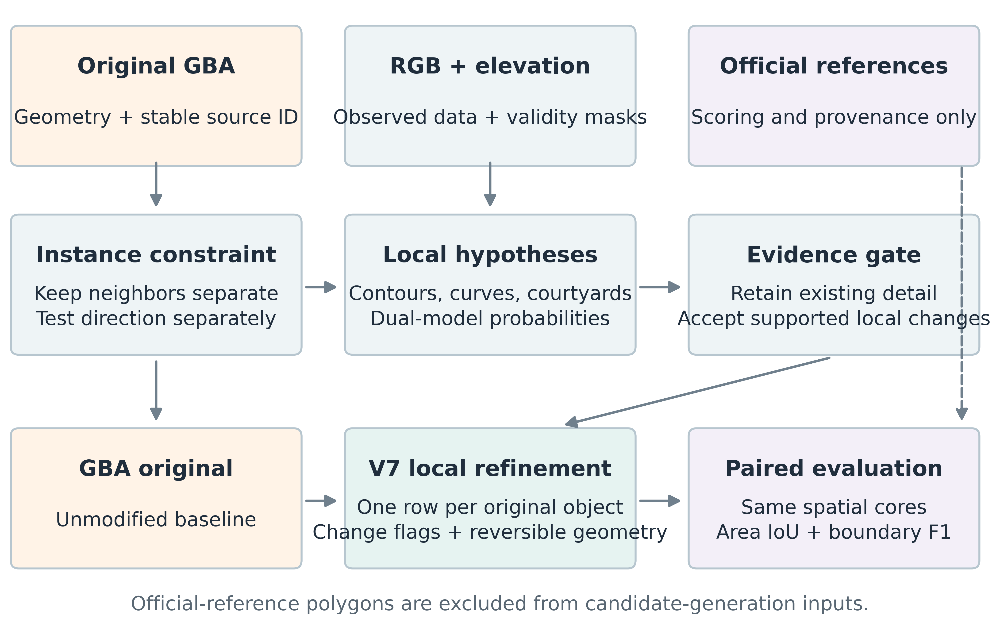

*September 11 scientific workflow. Official reference polygons are used for scoring and provenance review, not for generating candidates in this frozen evaluation.*

Earlier V5/V6 processing reshaped too much of the existing inventory. A census covered 7,525 train/validation windows and 591,775 unique buildings, while a separate 40-window MassGIS comparison found pooled IoU falling from 93.18% for GBA to about 80.20% after the older processing. This motivated V7's emphasis on local changes and retaining existing detail.

V7 requires multiple forms of support before accepting an edit. Additions use model probabilities, image-boundary evidence, and height where available; missing height invokes stricter image/model requirements. Removals require strong negative model evidence and valid low-height support. Circular or elliptical replacements and courtyard openings have separate geometric checks. Neighbor constraints help prevent objects from merging or encroaching on one another.

The current workflow flags possible small false positives for review instead of deleting whole buildings, and it does not create new building instances. Inherited GBA heights remain inherited attributes; this pipeline does not re-estimate building heights.

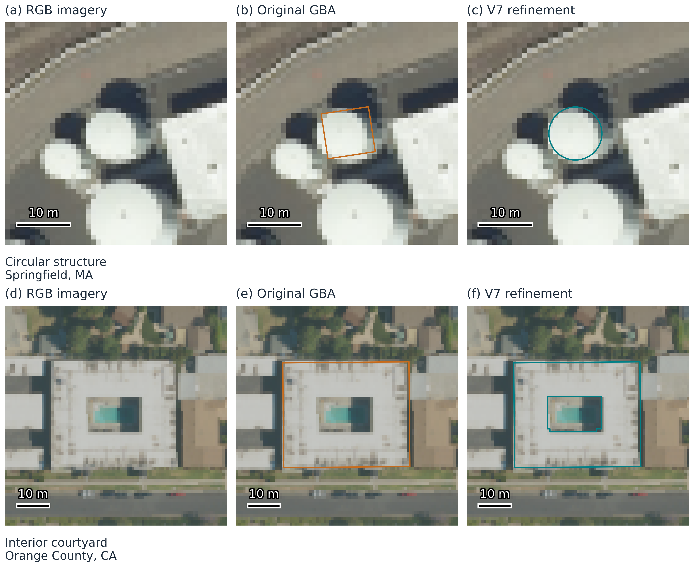

*Selected September 11 examples: a circular structure in Springfield and a courtyard in Orange County. These illustrate particular mechanisms; they are not a random sample of successful edits or demonstrations of the later production circle policy.*

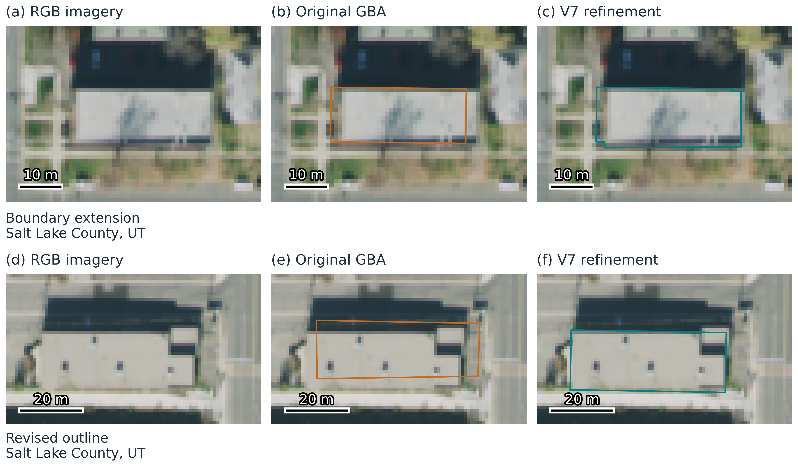

*Local boundary proposals from the frozen scientific version. Each comparison uses the same observed imagery and extent.*

## 6. Multi-region evaluation: improvements and failures

The accepted September 11 scientific evaluation contains **48,772 unique GBA objects**, including 60 development examples. V7 modified **1,887 objects (3.87%)**. The modification categories below describe actions, not independently verified improvements.

| Modification category | Objects |
| --- | ---: |
| Local additions | 1,319 |
| Local removals | 347 |
| Circular or elliptical revisions | 135 |
| Both additions and removals | 83 |
| Courtyard openings | 3 |

The main reference comparison covers **389 windows and 71.42 km² of evaluation cores** across Massachusetts expansion areas, Springfield, Salt Lake County, and Forsyth County.

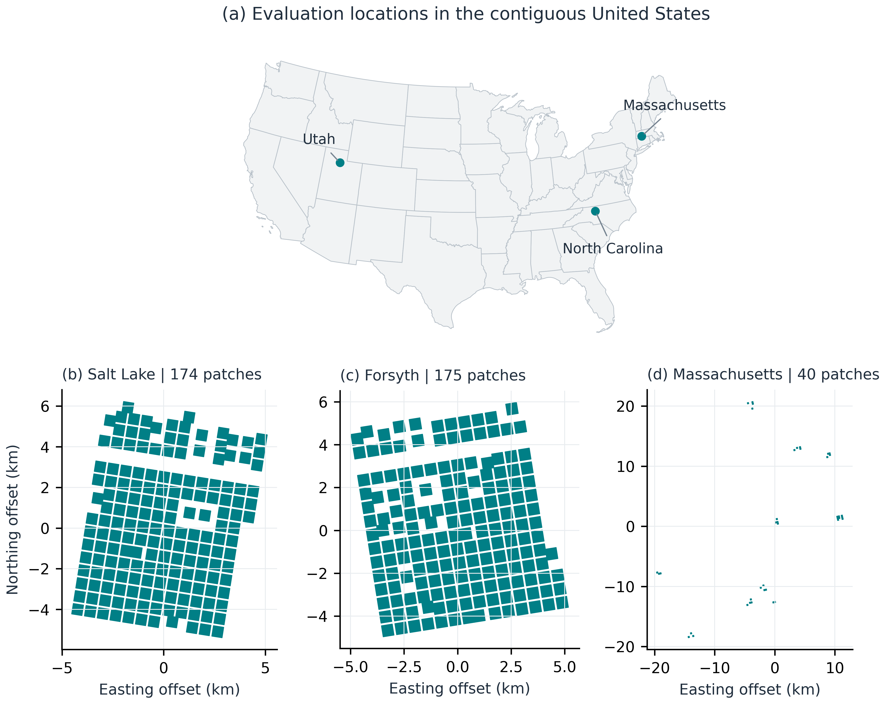

The following scores use the same spatial cores and the `current_reference` scenario. IoU is pooled intersection over pooled union; boundary F1 uses a 1 m tolerance. These are regional scores, not averages of individual-building scores.

| Region | Windows | GBA IoU (%) | V7 IoU (%) | GBA BF1 (%) | V7 BF1 (%) |
| --- | ---: | ---: | ---: | ---: | ---: |
| Massachusetts expansion | 32 | 94.72 | 94.29 | 96.08 | 95.41 |
| Springfield, MA | 8 | 89.63 | 89.55 | 90.54 | 90.04 |
| Salt Lake County, UT | 174 | 78.23 | 78.09 | 80.36 | 79.66 |
| Forsyth County, NC | 175 | 78.55 | 78.53 | 77.42 | 77.39 |

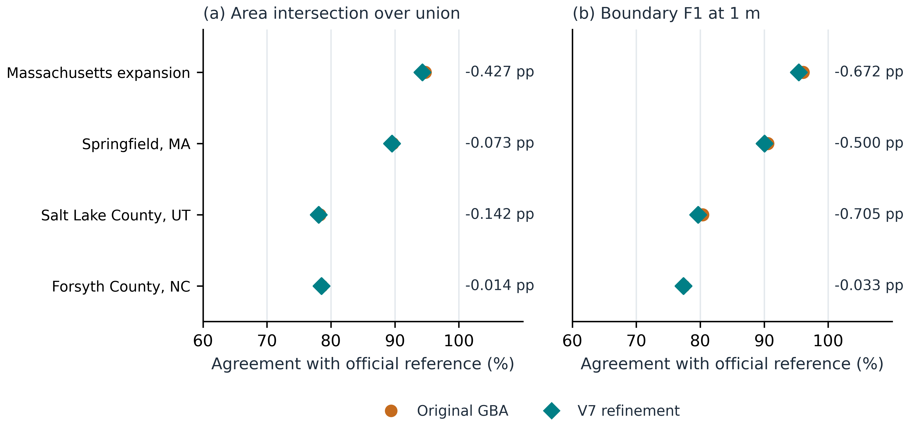

**V7's overall agreement is slightly lower in all four regions.** The modified subset deserves particular attention: among 1,371 modified objects with fixed reference matches, mean object IoU fell from 78.45% to 72.50%. Using a ±0.01 IoU threshold, 344 increased, 908 decreased, and 119 were neutral. Another 516 modified objects lacked a fixed match and are excluded from that comparison.

Those subset scores are object averages and cannot be directly compared with the pooled regional scores. The result nevertheless shows why a small overall decrease should not conceal larger problems among the objects actually changed.

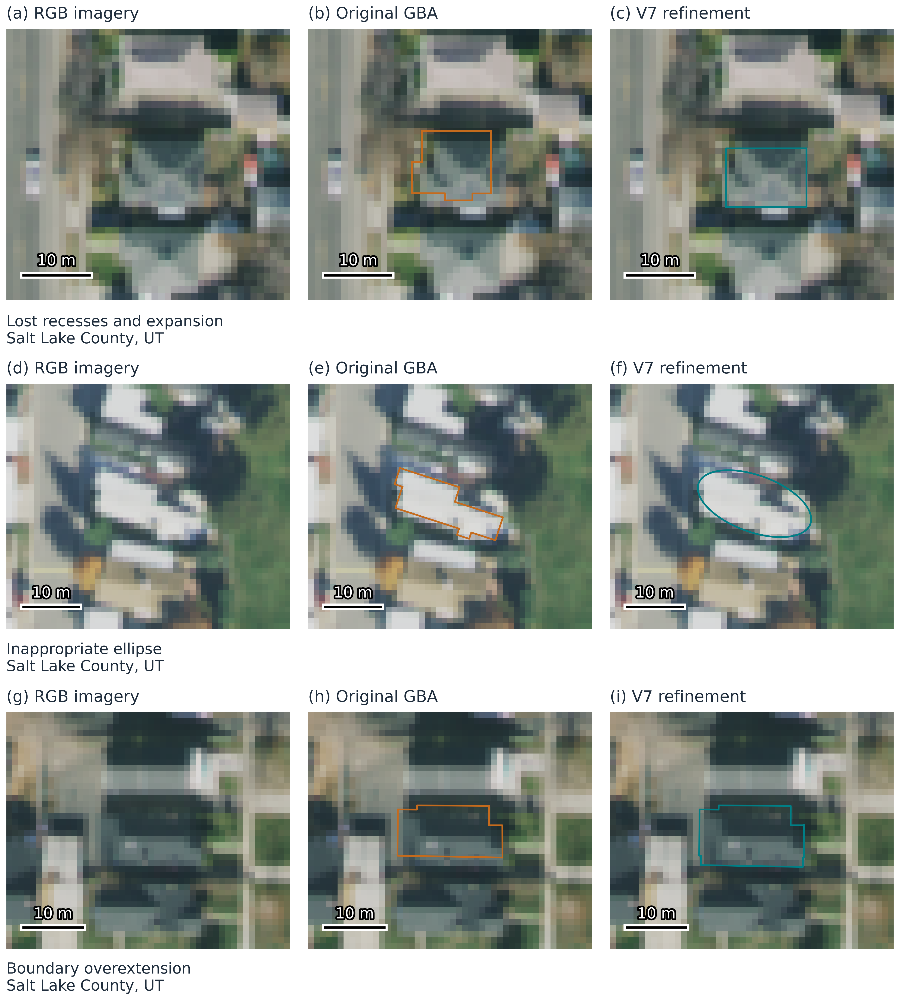

*Failure examples from Salt Lake County. A cleaner-looking polygon can remove real details, fit an inappropriate curve, or extend beyond the supported boundary.*

Reference provenance also matters. Government building datasets may share ancestry with OSM or other inputs to GBA, and imagery and reference footprints can represent different dates. We therefore describe these scores as **reference agreement**, not uniformly independent ground-truth accuracy. Neither selected visual examples nor repeatedly used development sets establish nationwide improvement.

## 7. Moving from scientific experiments to production

Production uses frozen models, tiled processing, stable source identifiers, neighbor context, and resumable work records. Each committed product retains the final and original geometry, modification flags and reasons, inherited attributes, input coverage, and processing versions. A per-cell commit manifest identifies the active files, preventing older and newer outputs from being combined accidentally.

### A stricter circle policy

Production review exposed inappropriate circular replacements. The September 18 policy therefore requires exact OSM type-and-ID reference confirmation for applicable circle proposals. Unconfirmed candidates revert to the original GBA geometry. Missing confirmation means insufficient support, not proof that the proposed curve is wrong.

In a 24,853-building Los Angeles pilot, all 88 circle proposals were withdrawn because they lacked the required support, reducing the modified count from 317 to 229. Applying the policy to 148,411 previously committed buildings withdrew 235 circle proposals and reduced modifications from 1,244 to 1,009. This is a conservative production check, not an independent accuracy assessment.

Recognized invalid candidate geometries also fall back to valid original geometry with a recorded reason. Invalid source geometry or missing required context is held for review. The later CPU recovery preserves these scientific rules while improving resumability and avoiding competing coordinators writing to the same queue.

### Scale and version boundaries

At **September 24, 2026, 16:19 EDT**, the production status recorded **2,249 completed delivery cells, 7,462,544 committed building objects, and 176,795 modified objects (about 2.37%)**. Processing remains incomplete. The current prepared scope covers six states; the longer-term target is the contiguous United States and Washington, DC, with Alaska and Hawaii deferred.

Three versions must remain distinguishable:

| Version | What its evidence supports |
| --- | --- |
| September 11 scientific V7 | The four-region comparison and figures above |
| Subsequent production V7 with OSM circle confirmation | Committed output counts, engineering checks, and policy-specific local audits |
| Later rural/50,000-patch model experiments | Development metrics; these models have not replaced production weights |

The current production circle policy has not been rescored across the same four-region protocol. The 2.37% production modification rate and 3.87% scientific-cohort rate therefore describe different populations and versions, not an accuracy trend.

## 8. What comes next

The next priorities are to evaluate the current production policy on the same frozen reference domains, obtain more independent geographic evaluation, and diagnose errors by building size, boundary complexity, and elevation availability. The recent negative training results make targeted error analysis more useful than assuming that more updates or another module will improve the product.

Application work also needs explicit footprint semantics: a roof extension, open canopy, or courtyard can matter differently for building-energy modeling and other spatial analyses. Those uses motivate inspectable geometry and source attributes, but downstream application benefits have not yet been established by the results reported here.

A data-descriptor manuscript and its supporting figures have been drafted. A public data repository, persistent identifier, final release coverage, and release documentation are still pending. The immediate deliverable is an auditable research and processing workflow with measured strengths and weaknesses.

## Research records and resources

The numeric tables in this update were checked against frozen evaluation tables and completed experiment records. Small companion files provide the values and version identifiers behind the post:

- [Regional reference-agreement results (CSV)](regional-validation.csv)
- [Final endpoint results for the architecture and targeted-sampling experiments (CSV)](development-experiments.csv)
- [Source and version notes for this update](update-sources.txt)

Upstream data and software:

- [GlobalBuildingAtlas paper](https://doi.org/10.5194/essd-17-6647-2025) and [dataset record](https://doi.org/10.14459/2025MP1782307)
- [USGS NAIP data dictionary](https://www.usgs.gov/centers/eros/science/national-agriculture-imagery-program-naip-data-dictionary)
- [MassGIS 2023 aerial imagery](https://www.mass.gov/info-details/massgis-data-2023-aerial-imagery) and [building structures](https://www.mass.gov/info-details/massgis-data-building-structures-2-d)
- [OpenStreetMap contributors](https://www.openstreetmap.org/copyright) and [Geofabrik extracts](https://download.geofabrik.de/)
- [Segmentation Models PyTorch](https://github.com/qubvel/segmentation_models.pytorch), used for the original U-Net prototype
- [Polygonal Building Extraction by Frame Field Learning](https://openaccess.thecvf.com/content/CVPR2021/html/Girard_Polygonal_Building_Extraction_by_Frame_Field_Learning_CVPR_2021_paper.html), relevant background for orientation-aware shape modeling; the present B1 is a custom implementation

All aerial-image comparison figures are existing research outputs using observed imagery. They show the explicitly labeled historical or scientific versions and have not been synthetically enhanced.
